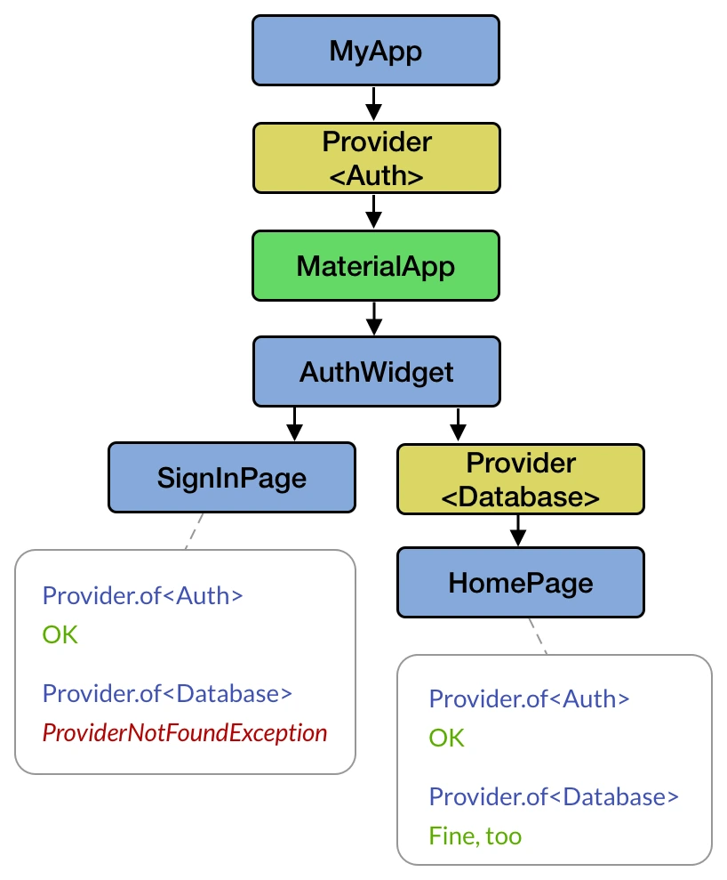
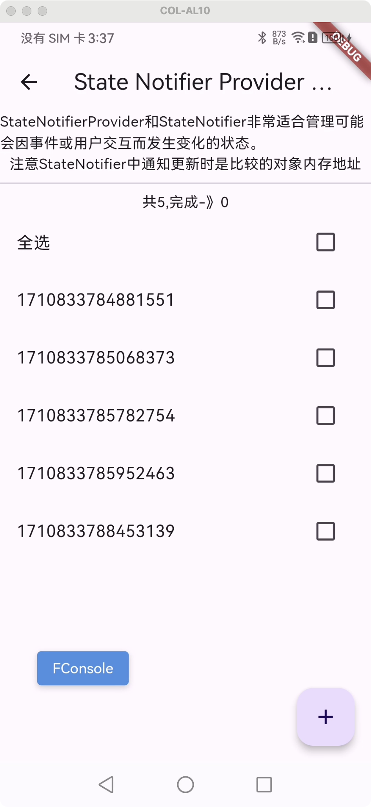

原文来自：https://codewithandrea.com/articles/flutter-state-management-riverpod/

### 是什么
Riverpod是一个响应式缓存和数据绑定框架，由Provider软件包演化而来。根据官方文档的说法，riverpod 是把 provider 重写了，实现了原来无法实现的功能。
### 为什么使用 riverpod 
从设计上来说，Provider是对`InheritedWidget`的改进，因此它依赖于小部件树。
这是一个不幸的设计决策，可能会导致常见的`ProviderNotFoundException`：

另一方面，Riverpod是编译时安全的，因为所有的 provider 都被声明为全局的，可以在任何地方访问，这也意味着这些 provider 可以不依赖于widget tree 来存储应用状态和业务逻辑。由于 Riverpod 是一个反应式框架，因此只需在需要时重建providers和widgets即可。

### 安装

3.0 已经有 preview 版本了，但还没有出正式版，这里使用稍微旧一点的版本
``` yaml
dependencies:
  flutter_riverpod: ^2.4.10
``` 
为了简单起见，这里没有使用`hooks_riverpod`,至于使用注解来生成 provier，会在后续介绍。

### 使用

首先我们需要改造一下程序入口，提供一个`ProviderScope`
``` dart
void main() {
  runApp(
    ProviderScope(
      child: MyApp(),
    ),
  );
}
```
接着声明一个全局的`Provider`，和这个 main 方法平级就可以
``` dart
final authorNameProvider = Provider<String>(
  (ref) => "xuan",
);
```
然后改造一下`MyApp`,让它可以读取到数据。改造前是继承`StatelessWidget`,这里需要改成继承自`ConsumerWidget`.
``` dart
class MyApp extends ConsumerWidget {
  @override
  Widget build(BuildContext context, WidgetRef ref) {
    final String value = ref.watch(helloWorldProvider);

    return MaterialApp(
      home: Scaffold(
        appBar: AppBar(title:  Text('ProviderWidget')),
        body: Center(
          child: Text(value),
        ),
      ),
    );
  }
}
```
可以看到，继承`ConsumerWidget`之后，`build`方法的签名变了，多了一个`WidgetRef`对象，我们就是使用这个对象来读取、观察、监听各种 provider。

除了继承`ConsumerWidget`之外，还有其他方案可供使用

#### 使用 Consumer
在旧代码中新增使用 riverpod，但又不打算大面积重构时，可以考虑这种方案:使用`Consumer`包裹需要更新的控件。

``` dart
import 'package:flutter/material.dart';
import 'package:flutter_riverpod/flutter_riverpod.dart';
import 'package:flutter_widget/third_part/riverpod/riverpod_widget.dart';
import 'package:widget_with_codeview/widget_with_codeview.dart';

class ProviderWithConsumer extends StatelessWidget {
  @override
  Widget build(BuildContext context) {
    return Scaffold(
      appBar: AppBar(
        title: Text("ProviderWithConsumer"),
        centerTitle: true,
      ),
      body: WidgetWithCodeView(
        child: Column(children: [
          Text(
            "有一个包含复杂布局的大型小部件类，您可以使用 Consumer 来仅重新构建依赖于提供者的小部件\n创建小而可重用的小部件有利于组合，使代码更加简洁、性能更高，更易于理解。\n如果您遵循这一原则并创建小而可重用的小部件，那么大部分时间您将自然而然地使用 ConsumerWidget。",
            style: TextStyle(color: Colors.blue, fontSize: 16),
          ),
          Consumer(builder: (_, ref, __) {
            return Text(ref.read(helloWorldProvider));
          })
        ]),
        filePath: "lib/third_part/riverpod/provider_with_consumer.dart",
      ),
    );
  }
}
```
上述代码中的`WidgetWithCodeView`是三方库`widget_with_codeview`用来展示代码的控件。去除后没有影响。

#### 使用ConsumerStatefulWidget
相对于`ConsumerWidget`来代替`StatelessWidget`,`使用ConsumerStatefulWidget`是用来代替`StatefulWidget`.

``` dart
import 'package:flutter/material.dart';
import 'package:flutter_riverpod/flutter_riverpod.dart';
import 'package:flutter_widget/third_part/riverpod/riverpod_widget.dart';
import 'package:widget_with_codeview/widget_with_codeview.dart';

class ProviderWithConsumerStatefulWidget extends ConsumerStatefulWidget {
  @override
  ConsumerState<ProviderWithConsumerStatefulWidget> createState() {
    return ProviderWithConsumerStatefulWidgetState();
  }
}

class ProviderWithConsumerStatefulWidgetState
    extends ConsumerState<ProviderWithConsumerStatefulWidget> {
  @override
  void initState() {
    super.initState();
    // 3. if needed, we can read the provider inside initState
    final helloWorld = ref.read(helloWorldProvider);
    print(helloWorld); // "Hello world"
  }

  @override
  Widget build(BuildContext context) {
    // 4. use ref.watch() to get the value of the provider
    final helloWorld = ref.watch(helloWorldProvider);

    return Scaffold(
      appBar: AppBar(
        title: Text("ProviderWithConsumerStatefulWidget"),
        centerTitle: true,
      ),
      body: WidgetWithCodeView(
        child: Column(
          children: [
            Text(
              "ConsumerStatefulWidget可以用来代替StatefulWidget\n当我们从ConsumerState进行子类化时，我们可以在所有小部件生命周期方法中访问ref对象。这是因为ConsumerState声明WidgetRef作为属性，类似于Flutter的State类声明BuildContext作为可以在所有小部件生命周期方法中直接访问的属性。",
              style: TextStyle(color: Colors.blue, fontSize: 16),
            ),
            Text(helloWorld),
          ],
        ),
        filePath:
            "lib/third_part/riverpod/provider_with_consumerStatefulWidget.dart",
      ),
    );
  }
}

```
同样的需要使用`ConsumerState`代替原来的`State`.需要注意的是,在这里面我们并没有看到`WidgetRef`,但我们依旧可以在整个页面声明周期内访问`WidgetRef`对象的实例`ref`,这是因为`ConsumerState`将`WidgetRef`声明为属性。

### WidgetRef是什么
官方文档定义`WidgetRef`为允许Widgets和Provider交互的对象。可以用来观察(watch)Provider 值的改变，也可以作为`Consumer`和`ConsumerWidget`的参数，同样也可以作为`ConsumerState`的属性。
将`WidgetRef`和`BuildContext`做一下比较：我们可以通过`BuildContext`在 Widget tree 中访问祖先节点，比如`Theme.of(context)` 和 `MediaQuery.of(context)`
而`WidgetRef`可以让我们在 app 中访问任意provider，前提是provider被声明为全局的。这也是设计的初衷。
当然，将 provider 声明在类内部，只允许该类访问在编译、运行时也不会报错，但这会影响关注点分离的原则。

### 八中不同的 Provider


* Provider
* ~~StateProvider~~ (被NotifierProvider代替)
* ~~StateNotifierProvider~~ (被NotifierProvider代替)
* FutureProvider
* StreamProvider
* ~~ChangeNotifierProvider~~ (被NotifierProvider代替)
* NotifierProvider (Riverpod 2.0新增)
* AsyncNotifierProvider (Riverpod 2.0新增)

以后会提到使用`riverpod_generator`包中的`@riverpod`注解来代替我们的手动声明provider


#### Provider
上面示例中的代码就是用的这一个，更适合提供一些不会变的常量值，比如 Dio 实例、版本号、格式化对象、数据库对象等

``` dart
final dateFormatterProvider = Provider<DateFormat>((ref) {
  return DateFormat.MMMEd();
});

class SomeWidget extends ConsumerWidget {
  @override
  Widget build(BuildContext context, WidgetRef ref) {
    // retrieve the formatter
    final formatter = ref.watch(dateFormatterProvider);
    // use it
    return Text(formatter.format(DateTime.now()));
  }
}
```
#### StateProvider
可以用来存储一些简单的变量，比如计数器

``` dart
import 'package:flutter/material.dart';
import 'package:flutter_riverpod/flutter_riverpod.dart';

final globalStateProvider = StateProvider((ref) => 1);
class StateProviderDemoWidget extends ConsumerWidget {
  //不推荐
  final localStateProvider = StateProvider((ref) => 1);

  @override
  Widget build(BuildContext context, WidgetRef ref) {
    return Scaffold(
      appBar: AppBar(
        title: Text("StateProviderDemoWidget"),
        centerTitle: true,
      ),
      body: Center(
          child: Flex(
        direction: Axis.vertical,
        children: [
          Text("globalStateProvider count ${ref.watch(globalStateProvider)}"),
          Text("localStateProvider count ${ref.watch(localStateProvider)}"),
          Text(
            "StateProvider.state标记为过时，并将在3.0移除",
            style: TextStyle(color: Colors.red, fontSize: 14),
          ),
          Text("声明为全局，则状态一直被保存，直到应用重启。",
              style: TextStyle(color: Colors.blue, fontSize: 14)),
          Text("声明为类成员，则页面重启则重新初始化。",
              style: TextStyle(color: Colors.blue, fontSize: 14)),
          Text("StateProvider适用于存储简单的状态变量，如枚举、字符串、布尔值和数字",
              style: TextStyle(color: Colors.blue, fontSize: 14)),
          IconButton(
            icon: Icon(Icons.plus_one_sharp),
            onPressed: () {
              ref.read(globalStateProvider.notifier).state++;
              ref.read(localStateProvider.notifier).state++;
            },
          ),
        ],
      )),
    );
  }
}

```
这里有一些有意思的事情。我们声明了两个 Provider，一个是全局的，一个是类内部的。
当我们打开页面点击几次按钮之后，页面内容更新，这时候我们返回上一页再次打开这个页面，会发现`globalStateProvider`提供的值还是上一次返回时候的值，而`localStateProvider`提供的值是初始值。因为`localStateProvider`在页面关闭时就被销毁了，这种情况似乎更符合我们没有使用 riverpod 的习惯。这里可以使用 autoDispose 让`globalStateProvider`在所有 watcher 被销毁也可以重置。

#### StateNotifierProvider
可以用它来监听和导出一个 `StateNotifier` ,`StateNotifierProvider` 和 `StateNotifier` 非常适合管理因事件或用户交互而改变的状态。这里有一个 `todolist`示例。
我们先定义一个 todo 的对象,实现一个 copyWith 方法来复制当前对象。
``` dart
@immutable
class Todo {
  const Todo(
      {required this.id, required this.description, required this.completed});

  final String id;
  final String description;
  final bool completed;
  Todo copyWith({String? id, String? description, bool? completed}) {
    return Todo(
      id: id ?? this.id,
      description: description ?? this.description,
      completed: completed ?? this.completed,
    );
  }
}
```

然后我们继承`StateNotifier`实现自己的`TodosNotifier`类，并完善所需逻辑
1. 统计已完成的待办
2. 添加待办
3. 删除待办
4. 完成、取消完成待办
5. 全选，反全选
6. 是否选中全部

``` dart

class TodosNotifier extends StateNotifier<List<Todo>> {
  TodosNotifier() : super([]);

  void addTodo(Todo todo) {
    state = [...state, todo];
  }

  int completedCount() {
    int count = 0;
    for (final todo in state) {
      if (todo.completed) {
        count++;
      }
    }
    return count;
  }

  void removeTodo(String todoId) {
    state = [
      for (final todo in state)
        if (todo.id != todoId) todo,
    ];
  }

  void toggle(String todoID) {
    state = [
      for (final todo in state)
        if (todo.id == todoID)
          todo.copyWith(completed: !todo.completed)
        else
          todo
    ];
  }

  void selectAll() {
    state = [for (final todo in state) todo.copyWith(completed: true)];
  }

  void unSelectAll() {
    state = [for (final todo in state) todo.copyWith(completed: false)];
  }

  bool isSelectAll() {
    bool result = true;
    for (final todo in state) {
      if (!todo.completed) {
        result = false;
        break;
      }
    }
    return result;
  }
}
```

接着声明一个全局的`StateNotifierProvider`

``` dart
final todoProvider =
    StateNotifierProvider<TodosNotifier, List<Todo>>((ref) => TodosNotifier());
```
最后我们就可以在页面中使用了

``` dart
import 'package:flutter/material.dart';
import 'package:flutter_riverpod/flutter_riverpod.dart';

class StateNotifierProviderWidget extends ConsumerWidget {
  @override
  Widget build(BuildContext context, WidgetRef ref) {
    List<Todo> todos = ref.watch(todoProvider);
    return Scaffold(
      appBar: AppBar(
        title: Text("State Notifier Provider Widget"),
        centerTitle: true,
      ),
      body: Column(
        children: [
          Text("StateNotifierProvider和StateNotifier非常适合管理可能会因事件或用户交互而发生变化的状态。"),
          Text("注意StateNotifier中通知更新时是比较的对象内存地址"),
          Divider(),
          Container(
            child: Text(
                "共${todos.length.toString()},完成-》${ref.read(todoProvider.notifier).completedCount()}"),
          ),
          CheckboxListTile(
            value: ref.read(todoProvider.notifier).isSelectAll(),
            onChanged: (value) {
              if (value ?? false) {
                ref.read(todoProvider.notifier).selectAll();
              } else {
                ref.read(todoProvider.notifier).unSelectAll();
              }
            },
            title: Text("全选"),
          ),
          Expanded(
              child: ListView(
            shrinkWrap: true,
            children: [
              for (final todo in todos)
                Dismissible(
                  key: Key(todo.id),
                  child: CheckboxListTile(
                    value: todo.completed,
                    onChanged: (value) =>
                        ref.read(todoProvider.notifier).toggle(todo.id),
                    title: Text(todo.description),
                  ),
                  onDismissed: (direction) =>
                      {ref.read(todoProvider.notifier).removeTodo(todo.id)},
                ),
            ],
          )),
        ],
      ),
      floatingActionButton: FloatingActionButton(
        child: const Icon(Icons.add),
        onPressed: () {
          final notifier = ref.read(todoProvider.notifier);
          notifier.addTodo(Todo(
              id: DateTime.now().microsecond.toString(),
              description: "${DateTime.now().microsecondsSinceEpoch}",
              completed: false));
        },
      ),
    );
  }
}

```
这样我们就完成了一个简易版的待办页面



#### FutureProvider
我们经常会遇到一些耗时操作，比如请求服务器接口获取到数据后展示在页面上；比如读取配置文件等。这种情况我们就需要 `FutureProvider`了。
这里以读取 assets 中的配置文件为例:
首先声明一个`FutureProvider`泛型中填入返回值，使用`rootBundle.loadString`来读取资源文件的内容。

``` dart
final getConfigFutureProvider =
    FutureProvider<Map<String, dynamic>>((ref) async {
  String configContant =
      await rootBundle.loadString("assets/fake_configurations.json");
  final configMap = jsonDecode(configContant) as Map<String, dynamic>;
  return configMap;
});
```
然后再声明一个用来模拟请求服务端的`FutureProvider`
``` dart
final wordPairProvider = FutureProvider<String>((ref)  async{
  final wordPair = generateWordPairs().first;
  await Future.delayed(Duration(seconds: 2));
  return "${wordPair.first} - ${wordPair.second}";
});
```
注意这里的`generateWordPairs`是三方包`english_words: ^4.0.0`提供的。在`wordPairProvider`中我们延迟 2 秒返回了结果，用以模拟网络耗时。
在页面中我们可以这么使用:

``` dart

class FutureProviderWidget extends ConsumerWidget {
  @override
  Widget build(BuildContext context, WidgetRef ref) {
    final AsyncValue<Map<String, dynamic>> getConfigResult =
        ref.watch(getConfigFutureProvider);
    final AsyncValue<String> wordPairResult = ref.watch(wordPairProvider);
    return Scaffold(
      appBar: AppBar(
        title: Text("FutureProvider"),
        centerTitle: true,
      ),
      body: RefreshIndicator(
        onRefresh: () => ref.refresh(wordPairProvider.future),
        child: ListView(
          children: [
            getConfigResult.when(
                data: (data) {
                  return Text(data.toString());
                },
                error: (error, stack) {
                  return Text(error.toString());
                },
                loading: () => const CircularProgressIndicator()),
            wordPairResult.when(data: (data) {
              return Text(data);
            }, error: (error, stack) {
              return ElevatedButton(
                  onPressed: () {
                    ref.refresh(wordPairProvider.future);
                  },
                  child: Text("点击刷新"));
            }, loading: () {
              return CircularProgressIndicator();
            }),
          ],
        ),
      ),
    );
  }
}

```
注意，`ref.watch(FutureProvider)`的返回值是AsyncValue类型，我们可以使用模式匹配的方式来更新UI。这里会有三个状态:data,loading,error。
我们在页面上添加了一个下拉刷新的控价来刷新模拟网络请求的 provider:`ref.refresh(wordPairProvider.future)`。
- FutureProvider功能非常强大，可以用它来
- 执行和缓存异步操作（如网络请求）
- 处理异步操作的错误和加载状态
- 将多个异步值合并为另一个值
- 重新获取和刷新数据（适用于拉到刷新操作）
如果退出页面需要重新进行刷新，我们可以配合autoDispose使用:`FutureProvider.autoDispose<String>((ref) async {}`

#### StreamProvider
这里例子不大好写，它和 FutureProvider 类似，被 watch 时返回的也是 AsyncValue 类型，这里是一个计时器的示例。
同样的，先声明一个`StreamProvider`
``` dart
final streamProvider = StreamProvider.autoDispose<int>((ref) {
    ref.onDispose(() {
      debugPrint("streamProvider autoDispose");
    });

    return Stream.periodic(Duration(seconds: 1), (number) {
      return number + 1;
    });
  });

```
然后在页面中使用
``` dart

class StreamProviderWidget extends ConsumerWidget {

  @override
  Widget build(BuildContext context, WidgetRef ref) {
    final AsyncValue<int> streamResult = ref.watch(streamProvider);
    return Scaffold(
      appBar: AppBar(
        title: Text("StreamProviderWidget"),
        centerTitle: true,
      ),
      body: Column(
        children: [
          Text(streamResult.toString()),
          streamResult.when(
                  data: (data) {
                    return Text(data.toString());
                  },
                  error: (error, stack) {
                    return Text(error.toString());
                  },
                  loading: () => CircularProgressIndicator())
        ],
      ),
    );
  }
}

```

#### ChangeNotifierProvider
建议使用 NotifierProvider 代替。
这里是一个计数器示例。

``` dart

class CounterNotifier extends ChangeNotifier {
  int _count = 0;
  int get count => _count;
  void increment() {
    _count++;
    notifyListeners(); // 当计数器值改变时通知所有监听者
  }
}

// 定义ChangeNotifierProvider
final counterProvider = ChangeNotifierProvider<CounterNotifier>((ref) {
  return CounterNotifier();
});

class ChangeNotifierProviderWidget extends ConsumerWidget{
  @override
  Widget build(BuildContext context, WidgetRef ref) {
    return  Scaffold(
        appBar: AppBar(title: Text('ChangeNotifierProviderWidget')),
        body: Center(
          child: Consumer(builder: (context, ref, _) { // 使用Consumer读取并显示状态
            final counter = ref.watch(counterProvider);
            return Text('Count: ${counter.count}');
          }),
        ),
        floatingActionButton: FloatingActionButton(
          onPressed: () {
            // 在点击按钮时，通过ref调用notifier的方法更新状态
            ref.read(counterProvider.notifier).increment();
          },
          child: Icon(Icons.add),
        ),
      );
  }
}
```

#### NotifierProvider
用来代替 StateProvider 和 ChangeNotifierProvider。
同样的，我们先定义一个数据类 Student
``` dart
class Student {
  Student({required this.name, required this.id});
  String name;
  String id;

  Student copyWith({String? copyID, String? copyName}) {
    return Student(name: copyName ?? this.name, id: copyID ?? this.id);
  }
  String toString(){
    return "$id : $name";
  }
}
```
定义一个继承自 Notifier 的类
``` dart

class StudentNotifier extends Notifier<Student> {
  @override
  Student build() {
    return generateStudent();
  }

  Student generateStudent() {
    final wordPair = generateWordPairs().first;
    final id = Random().nextInt(100);

    return Student(
        name: "${wordPair.first} - ${wordPair.second}", id: id.toString());
  }

  String toString() {
    return "${state.id} : ${state.name}";
  }

  void change() {
    state = generateStudent();
  }

  void changeNameWithCopy(String name) {
    state = state.copyWith(copyName: name);
  }

  void justChangeName(String name) {
    state.name = name;
  }

  void changeIdWithCopy(String id) {
    state = state.copyWith(copyID: id);
  }

  void justChangeId(String id) {
    state.id = id;
  }
}
```
注意，这里的 build 方法是必须的。同时为了解释刷新页面的条件，这里定义了几个改变属性的方法。xxxWithCopy是重新生成了对象，justxxx 则是在原对象上直接修改属性值。
然后声明`NotifierProvider`,这里提供了两种方式，哪一种都可以。
``` dart
final counterProvider = NotifierProvider<StudentNotifier, Student>(() {
  return StudentNotifier();
});
final counterProviderOther =
    NotifierProvider<StudentNotifier, Student>(StudentNotifier.new);
```

在页面中我们这样使用
``` dart

class CounterNotifierWidget extends ConsumerWidget {
  @override
  Widget build(BuildContext context, WidgetRef ref) {
    final student = ref.watch(counterProvider);
    ref.listen(counterProvider, (oldValue, newValue) {
      logger.d(
          "oldValue--> ${oldValue?.id.toString()} \n newValue--> ${newValue.id}");
    });

    return Scaffold(
      appBar: AppBar(
        title: Text("CounterNotifierWidget"),
        centerTitle: true,
      ),
      body: Column(
        children: [
          Text("student ${student.id.toString()} : ${student.name}  --> ${student.toString()}"),

          ElevatedButton(
              onPressed: () {
                ref
                    .read(counterProvider.notifier)
                    .changeIdWithCopy(Random().nextInt(100).toString());
              },
              child: Text("changeIdWithCopy")),
          ElevatedButton(
              onPressed: () {
                final wordPair = generateWordPairs().first;
                ref.read(counterProvider.notifier).changeNameWithCopy(
                    "${wordPair.first} - -${wordPair.second}");
              },
              child: Text("changeNameWithCopy")),

          ElevatedButton(
              onPressed: () {
                ref
                    .read(counterProvider.notifier)
                    .justChangeId(Random().nextInt(100).toString());
              },
              child: Text("justChangeId")),
          ElevatedButton(
              onPressed: () {
                final wordPair = generateWordPairs().first;
                ref
                    .read(counterProvider.notifier)
                    .justChangeName("${wordPair.first} - -${wordPair.second}");
              },
              child: Text("justChangeName")),
        ],
      ),
      floatingActionButton: FloatingActionButton(
        onPressed: () {
          ref.read(counterProvider.notifier).change();
        },
        child: Icon(Icons.change_circle),
      ),
    );
  }
}
```
运行之后可以看到，只有当我们调用`xxxwithCopy`时才会刷新页面。戳到`NotifierProviderElement`源码中查看`updateShouldNotify`方法，发现是调用的identical(previous, next)方法来做判断的。
``` dart
  @protected
  bool updateShouldNotify(State previous, State next) {
    return !identical(previous, next);
  }
```

#### AsyncNotifierProvider
相比`NotifierProvider`,它是异步而已.
还是先声明一个数据类Student
``` dart
class Student{
  Student({required this.name,required this.id});
  String name;
  String id;

  String toString(){
    return "$id - $name";
  }
}
```
声明一个继承自AsyncNotifier的类
``` dart

class StudentAsyncNotifier extends AsyncNotifier<Student>{
  @override
  FutureOr<Student> build() async {

      return getInfo();
  }

 Future<Student> getInfo()async{
    
    await  Future.delayed(Duration(seconds: 3));
    final wordPair = generateWordPairs().first;
    return Student(name: "${wordPair.first} - ${wordPair.second}", id: Random().nextInt(100).toString());
    
  } 

  Future<void> refresh() async{
      state = AsyncValue.loading();
      state = await AsyncValue.guard(()async {
        return getInfo();
      });
  }
}
```
声明一个 Provider
``` dart
final studentAsyncNotifier = AsyncNotifierProvider<StudentAsyncNotifier, Student>(() {
  return StudentAsyncNotifier();
});
```
在页面中使用
``` dart

class AsyncNotifierProviderWidget extends ConsumerWidget{
  @override
  Widget build(BuildContext context, WidgetRef ref) {

    final asyncValue = ref.watch(studentAsyncNotifier);

    return Scaffold(
      appBar: AppBar(title: Text("AsyncNotifierProviderWidget"),centerTitle: false,),
      body: asyncValue.when(data: (data){
       return Center(child: Text(data .toString()),);
      }, error: (error,stack){
       return Center(child: Text(error.toString()),);
      }, loading: (){
        return Center(child: CircularProgressIndicator());
      }),
      floatingActionButton: FloatingActionButton(onPressed: (){
        ref.read(studentAsyncNotifier.notifier).refresh();
      },child: Icon(Icons.refresh),),
    );
  }
}
```
以上就是 riverpod 中常见的 Provider 的用法示例，后面会介绍一些修饰符、注解相关的信息。

----
以上